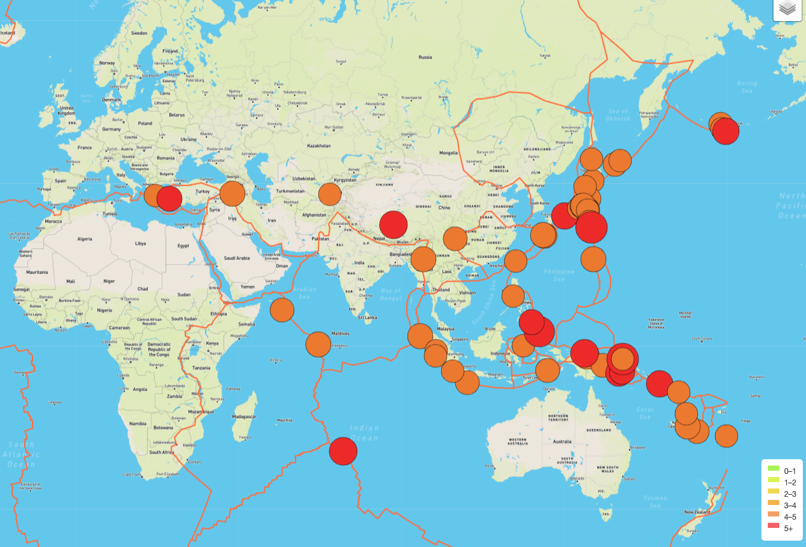
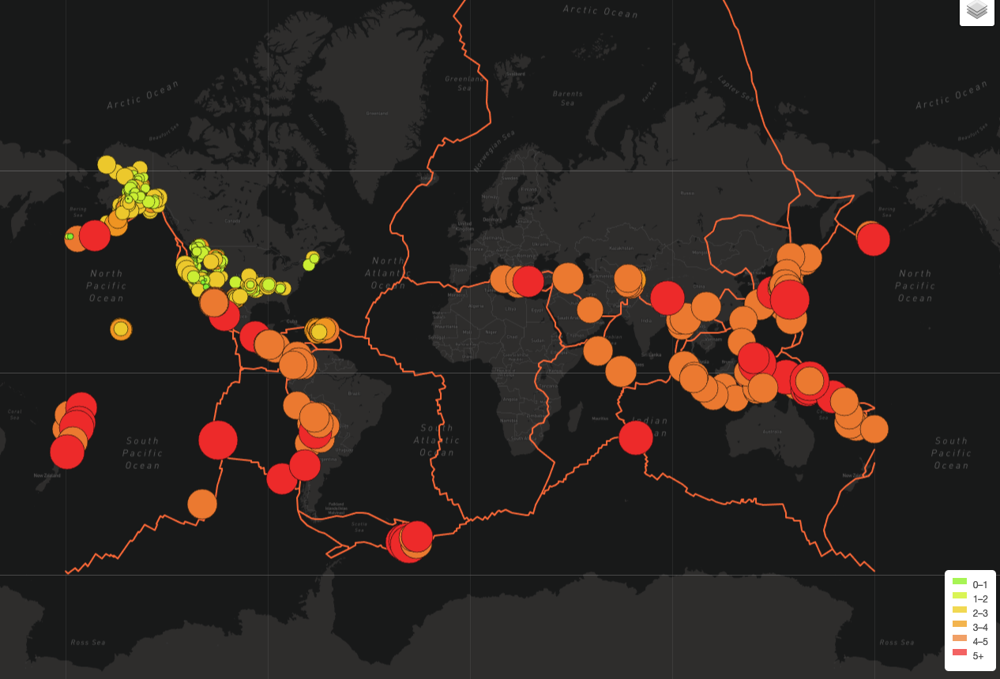
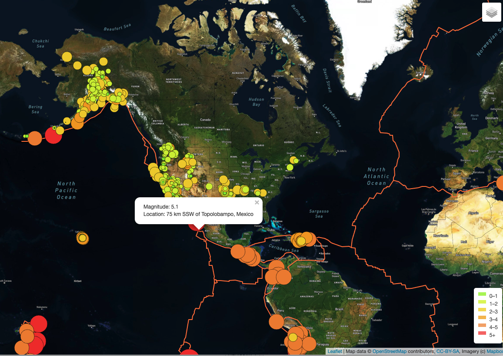
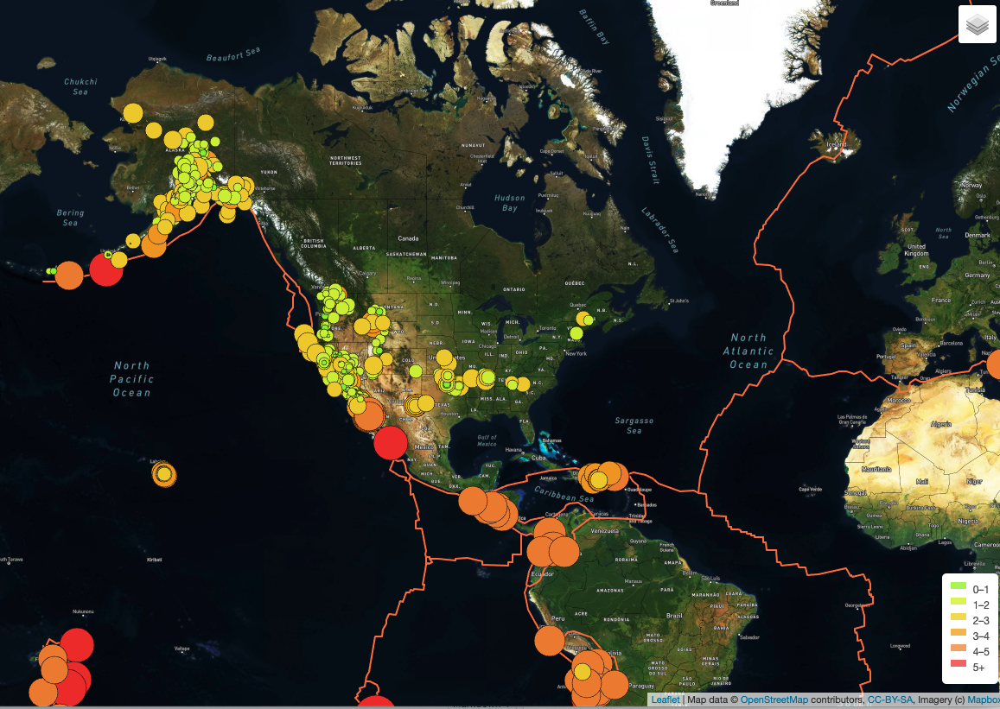

# Mapping Earthquakes

## Overview
This projects goal is to be able to map out visually Earthquakes around the world, not only their location, but the magnitude of the earthquake.  In addition to showing visually the magnitude of the earthquake, the goal will be to show the Earth's fault line so you can see how many of these earthquakes occur on or near a known fault line.

Enhancements will be to show the Earth in different views, so show these visualizations in different formats.

## Resources

*Data*:
* https://earthquake.usgs.gov/earthquakes/feed/v1.0/summary/all_week.geojson
* https://raw.github.com/fraxen/tectonicplates/master/GeoJSON/PB2002_boundaries.json
 
*Software*: JavaScript, Leaflet, MapBox and geoJSON data 

## Results

### Deliverable 1:
For Deliverable 1, the goal was to beable to Map the world and to outline the known Techtonic Plate Data.  For this I was able to gather the known data for the Techtonic Plates from GitHub at http://github.com/fraxen/techtonicplates and the file I used in GeoJSON format was _PB2002_Boundries.json_.  This site is free to use by anyone under the Open Data Commons Attribution License and was created by Hugo Ahlenius, Nordpil and Peter Bird.  The GeoJSON conversion was made in 2014 by _csterling_.

**The image below shows the Earth, in satellite image, with the Techtonic Plages outlined in orange.**  

_NOTE: The Upper Corner with the 3 Diamonds - That is a pull-down that actually allows you to chose the Map Style from "Street View", "Satellite View" and "Dark View"_ as well as how many layers you wish to add. 

---

### Deliverable 2:
For Deliverable 2, the goal was to add Major Earthquake Data to our original earthquake data.  For this I created 2 layers to our map, one is for "All Earthquakes" and one is for our "Major Earthquakes", which is those considered with a magnitude > 4.  I will show you images of the Earth with All Earthquakes and with just the Major Earthquakes so you can see the difference.

**The image below shows the Earth, in satellite image, with All Earthquakes, and has the fault lines.  The circle size/color is determined by the magnitude.  The Legend in the bottom right corner indicates the magnitude by color and of course the larger the magnitude the larger the circle as well.**

**The image below shows the Earth, in satellite image, with Major Earthquakes.  The circle size/color is determined by the magnitude.  The Legend in the bottom right corner indicates the magnitude by color and of course the larger the magnitude the larger the circle as well.**

### Deliverable 3:
For Deliverble 3: the goal was to add an additional Map.  With this I added the Dark Map, which I will show here.  I also wanted to show additional images of the map's features that visualizes more data that the JSON data provided and I could add to the Challenge, which I believe were part of the deliverables.

**The image below is an image of the Earth in the Street View, showing the Techtonic Plates as wall as the Major Earthquakes.

---
**The image below is an image of the Earth in the Dark View, showing the Techtonic Plates as wall as the All Earthquakes.

---
**The image below is an image of the Earth in the Satellite View, showing the Techtonic Plates as wall as the All Earthquakes, with a Pop-Up of a description of one of the earthquakes.  If you were to chose one of the "circles" a Pop-Up will give you the Magnitude and Location of the earthquake.

---
**The image below is the image of the Earth in the Satellite View, showing the Techtonic Plates as wall as the All Earthquakes.  If you were to chose one of the "circles" a Pop-Up will give you the Magnitude and Location of the earthquake.

## Summary

This challenge was definitly one that took me quite a bit of time to complete.  But it was great to see the maps come together and see the final product. JavaScript wasn't hard for me to understand, it was just the new products of Leaflet and their new options that I had to learn and remember to lookup.  Now that we are learning so many, the syntax changes are tripping me up with who needs an else if, or elif, etc.  I do like Visual Studio as it underlines items in Red, but that just says "something is wrong" so that gets me part-way.

So onto the next challenge!

Jill
